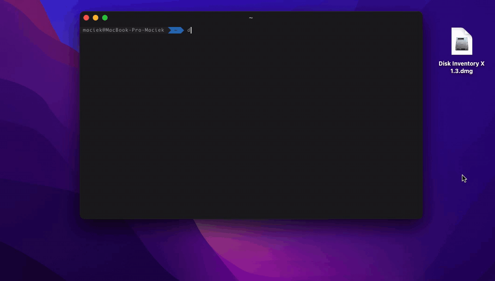
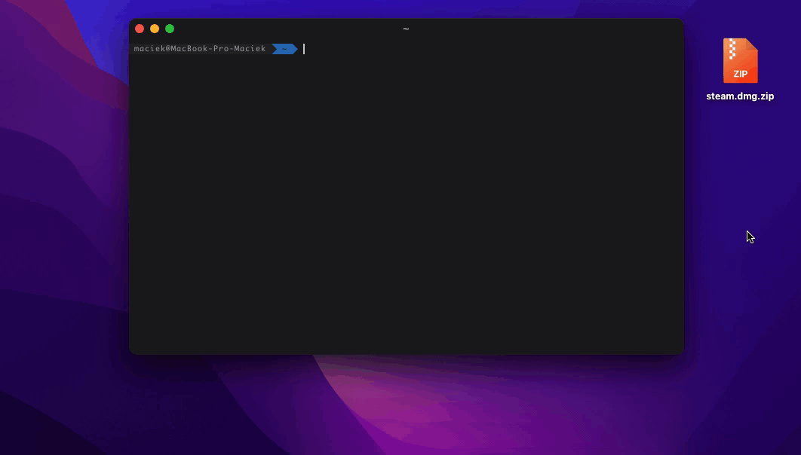
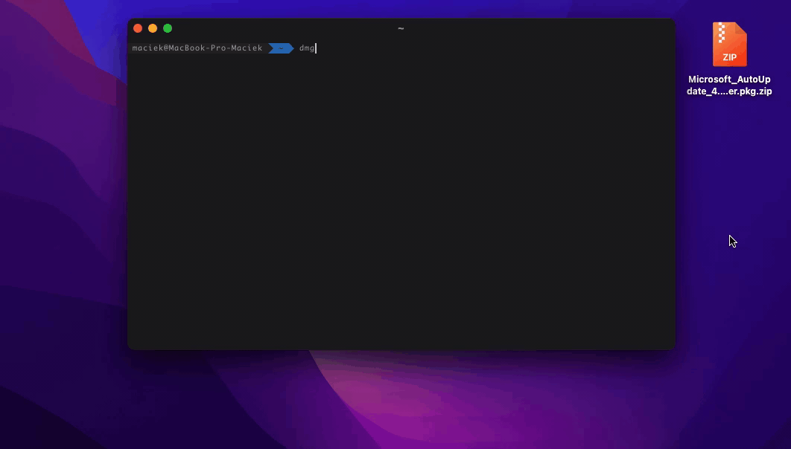

# dmginstall-python
 Dmg installer script, written in python. Pkg, tgz, tbz, tar.gz, tar,bz and zips also work.

## Requirements
Homebrew  
python3 from Homebrew  
Xcode Command Line Tools (install by typing in terminal ```xcode-select --install```)  
vcp (optional, read below)

## Installation
```bash
git clone https://github.com/Maciek-Hetman/dmginstall-python.git
cd dmginstall-python.git
cp dmginstall.py /usr/local/bin/dmginstall
cp vcp /usr/local/bin/vcp
```
Done.

## Usage
Type in terminal of your choice 
```bash
dmginstall /path/to/dmg/file.dmg 
```
You can also drag file to terminal window instead of manually typing whole path

## vcp
vcp is alternative to cp, with progress bar. It's optional if you don't necessarily
need it. It's compiled from [this github repo](https://github.com/Leask/VCP). See [copyright](vcp/COPYRIGHT).

## How does it work
Script detect given file format, in case of dmg it automatically mounts, copy and umount dmg file.
When given zip file, it unzips it, detects file type installs and remove unzipped files. It can also
install .pkg files using ```sudo installer -pkg [filename] -target /```



